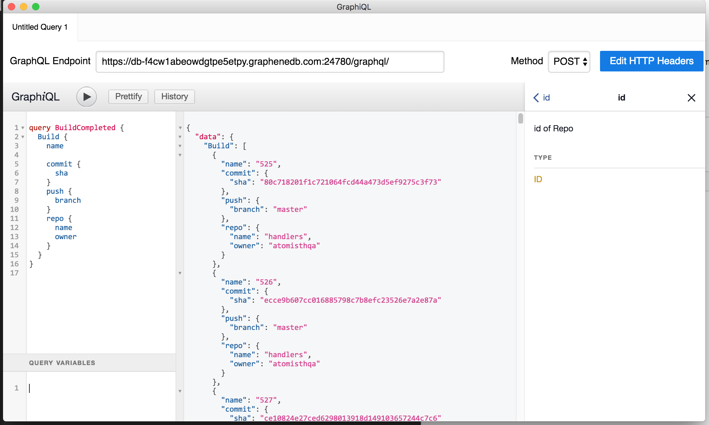

# Event Handlers
Command handlers act on the world, based on the content of the Atomist Cortex data model. They are typically invoked by a human: usually, by the Atomist bot.

## Setting Up a Subscription

First, you should define a query representing the data you want to match on. You typically begin by exploring Cortex data using a GraphQL client. GraphiQL is a great choice.

You will get assistance for writing your queries, and see the shape of the resulting data.



Once you're happy with your query, add it beginning with `subscription` to the `/graphql` directory of your project.

Next, generate TypeScript types for your query returns and varibles:

```
npm run gql-gen
```

You can rerun this command at any time, if you add or change queries.

Now import the generated types in your event handlers.

Subscription

The implementation of your event handler will be similar to a command handler. It is impossible to respond to